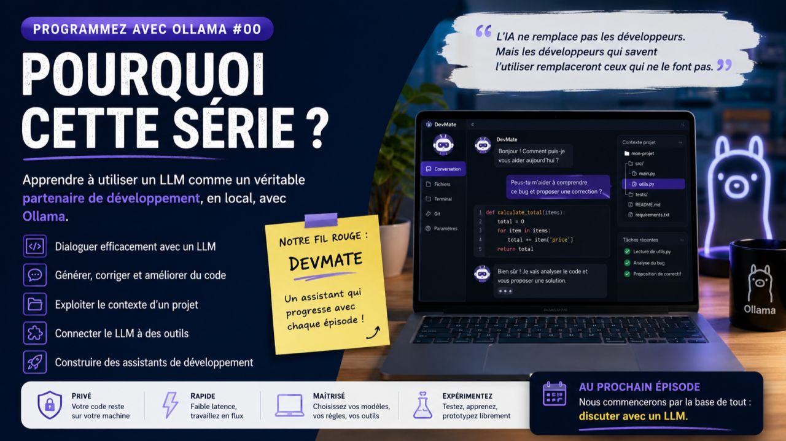

# Programmez avec Ollama : pourquoi cette série ?

Depuis quelques mois, les LLM (Large Language Models) se sont imposés dans le quotidien des développeurs.

Ils génèrent du code, expliquent des API, détectent des erreurs, rédigent de la documentation ou proposent des architectures. Pourtant, une question revient souvent :

*Comment intégrer concrètement un LLM local dans sa façon de développer ?*

Cette série est née de cette interrogation.

L’objectif n’est pas de présenter une énième démonstration d’intelligence artificielle spectaculaire. Nous allons plutôt apprendre à utiliser un LLM comme un véritable partenaire de développement.

Pour cela, nous nous appuierons sur **Ollama**, une solution qui permet d’exécuter des modèles de langage directement sur sa machine. Travailler en local offre de nombreux avantages : confidentialité du code, maîtrise des modèles utilisés, faible latence et possibilité d’expérimenter librement.

### Une approche résolument pratique

Au fil des articles, nous construirons progressivement un assistant de développement baptisé **DevMate**.

Il ne s’agira pas d’un simple chatbot, mais d’un assistant capable de nous accompagner dans les tâches quotidiennes d’un développeur :

* comprendre une base de code ;
* générer des fonctions ;
* expliquer des erreurs ;
* proposer des améliorations ;
* automatiser certaines tâches ;
* interagir avec des outils de développement.

Chaque nouvel épisode enrichira progressivement ses capacités.

### Ce que l'on découvrira

Cette série abordera notamment :

* dialoguer efficacement avec un LLM ;
* écrire de meilleurs prompts ;
* générer et corriger du code ;
* exploiter le contexte d’un projet ;
* construire des assistants spécialisés ;
* connecter un LLM à des outils externes ;
* découvrir les bases des agents IA.

L’objectif est de comprendre **comment programmer avec un LLM**, et non simplement **programmer grâce à un LLM**.

### Pour qui ?

Cette série s’adresse avant tout aux développeurs, quel que soit leur langage de prédilection.

Aucune expertise en intelligence artificielle n’est nécessaire. Si vous savez programmer et que vous êtes curieux de découvrir une nouvelle façon de développer, vous avez déjà tout ce qu’il faut.

Les exemples utiliseront principalement Python, mais les concepts restent applicables à n’importe quel environnement de développement.

### Ce que cette série n’est pas

Nous ne chercherons pas à comparer les modèles ni à établir un classement des meilleures IA du moment.

Nous ne passerons pas non plus des pages à expliquer le fonctionnement interne des réseaux de neurones.

Notre objectif est beaucoup plus concret : apprendre à tirer parti d’un LLM dans le quotidien d’un développeur.

### Rendez-vous au prochain épisode

Dans le premier article, nous commencerons par la base de tout : **discuter avec un LLM**.

Cela peut sembler évident… mais obtenir de bonnes réponses est un véritable savoir-faire. Nous verrons qu’un LLM n’est pas un moteur de recherche, ni un compilateur, ni un oracle. C’est un interlocuteur dont il faut apprendre le langage.

Bienvenue dans **Programmez avec Ollama**.
