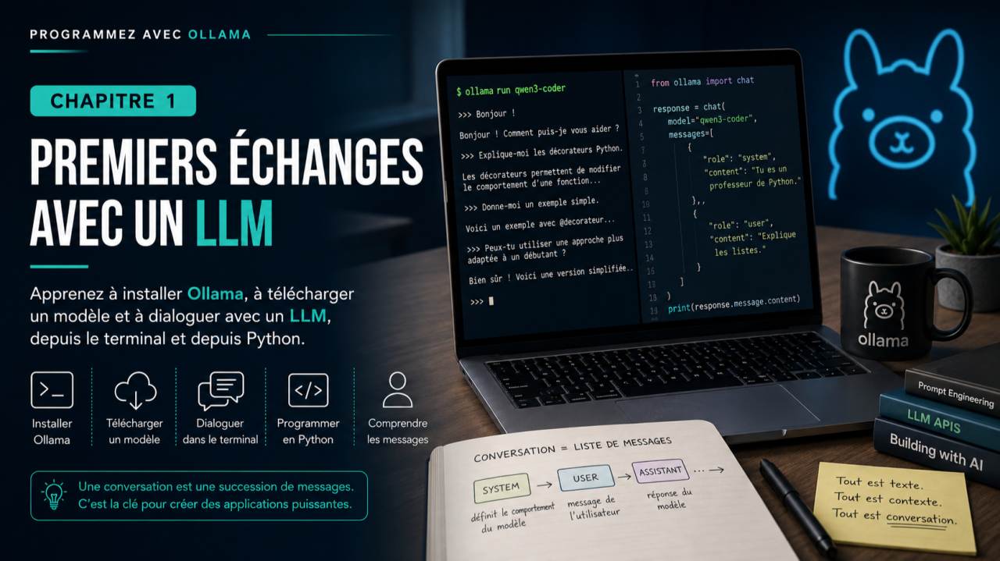
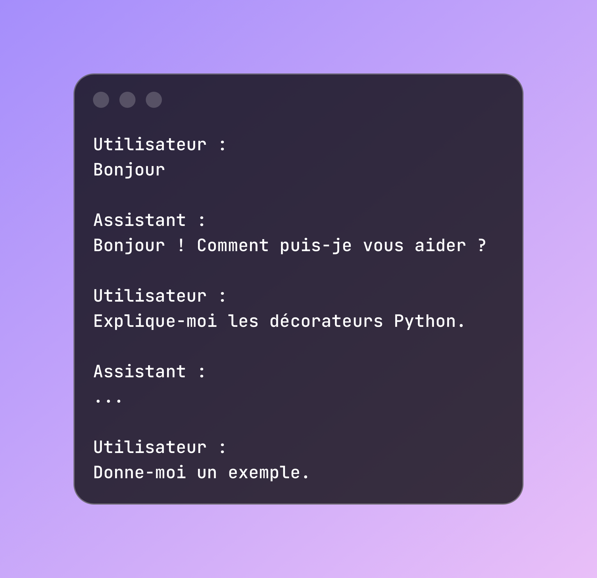
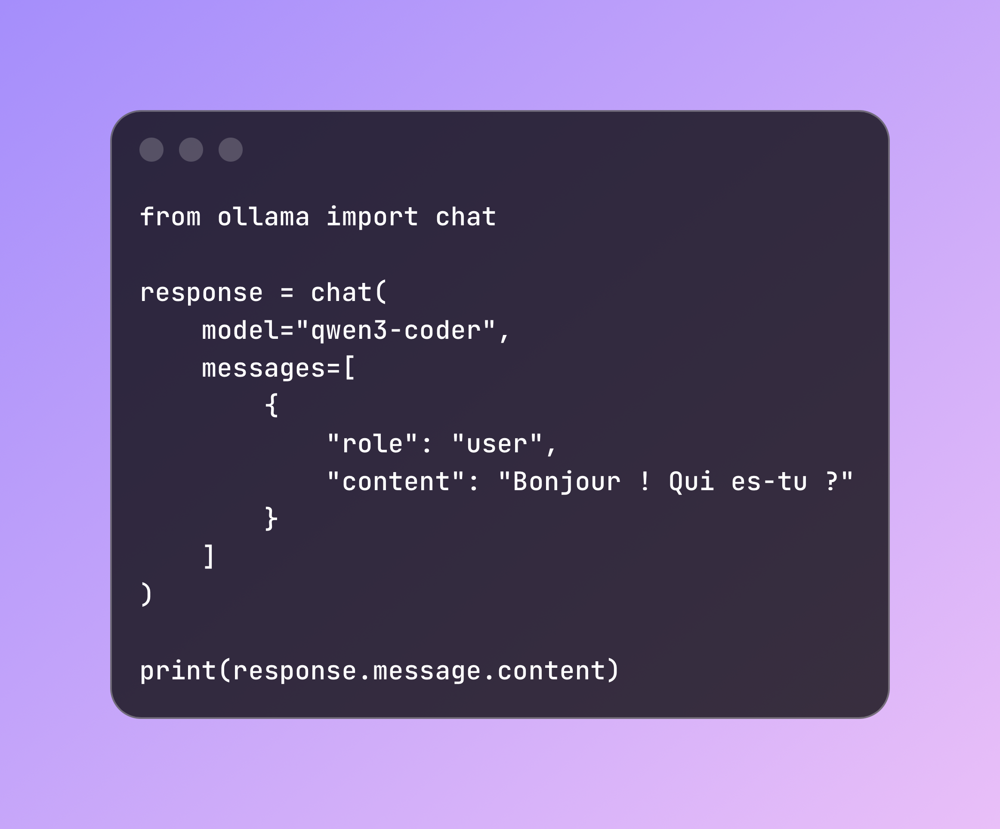
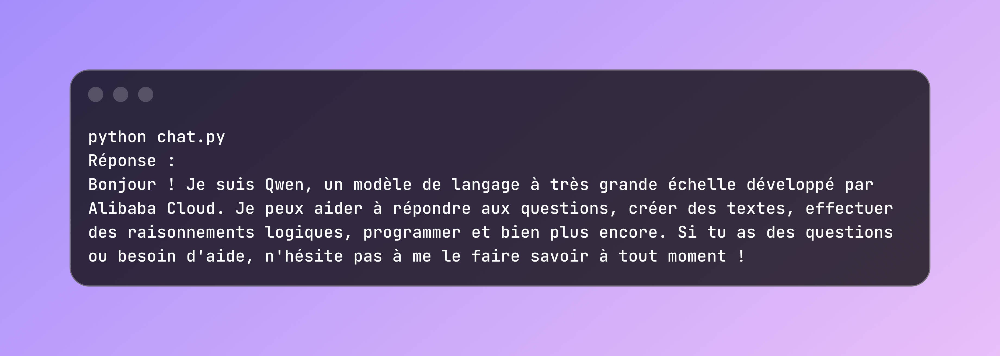
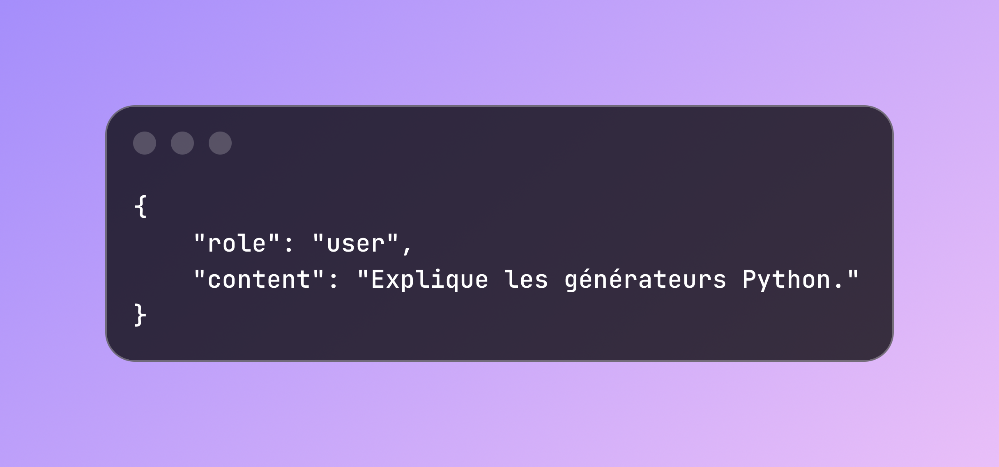

# Programmez avec Ollama - Chapitre 1 – Premiers échanges avec un LLM



### Objectifs

À la fin de ce chapitre, vous serez capable de :

* installer et utiliser Ollama ;
* télécharger un modèle de langage ;
* dialoguer avec un LLM depuis le terminal ;
* comprendre comment une conversation est représentée ;
* écrire votre premier programme Python utilisant Ollama.

Plus important encore, vous comprendrez qu’un LLM ne s’utilise pas comme une bibliothèque classique : on ne lui demande pas d’exécuter une fonction, on engage une conversation.

---

## Pourquoi un LLM en local ?

Depuis l’arrivée des grands modèles de langage (LLM), la plupart des développeurs ont découvert l’intelligence artificielle à travers des services accessibles sur Internet comme ChatGPT ou Claude.

Ces plateformes sont extrêmement simples à utiliser : il suffit d’ouvrir un navigateur, de saisir une question et d’attendre la réponse.

Mais lorsqu’il s’agit de développer une application, cette approche montre rapidement ses limites.

Comment intégrer un LLM dans son propre programme ? Comment automatiser certaines tâches ? Comment conserver une conversation ? Comment envoyer des documents ? Comment créer un assistant spécialisé ?

Pour répondre à ces questions, nous avons besoin d’un modèle que nous pouvons piloter directement depuis notre code.

C’est précisément le rôle d’Ollama.

Ollama permet d’exécuter un modèle de langage directement sur votre ordinateur, sans dépendre d’un service distant. Vous gardez ainsi la maîtrise de vos données, vous pouvez travailler sans connexion Internet et expérimenter librement sans vous soucier du coût des appels à une API.

Tout au long de cet ouvrage, nous construirons progressivement un assistant de développement nommé **DevMate**, qui nous servira de fil rouge pour découvrir les principales fonctionnalités d’Ollama.

Mais avant d’écrire notre premier assistant, commençons par discuter avec un modèle.

---

## Installer Ollama

Avant de commencer, vous devez disposer d’une installation fonctionnelle d’Ollama.

La procédure d’installation évoluant régulièrement, nous vous recommandons de suivre les instructions de la documentation officielle :

[https://ollama.com/download](https://ollama.com/download)

Une fois l’installation terminée, vérifiez simplement que tout fonctionne :

```
ollama --version
```

Tout au long de cet ouvrage, nous utiliserons principalement **Qwen3-Coder**, un modèle particulièrement performant pour les tâches de programmation. Rien ne vous empêche cependant d’utiliser un autre modèle compatible avec Ollama. Les exemples fonctionneront de la même manière.

Téléchargez ensuite le modèle de votre choix. Par exemple :

```
ollama pull qwen3-coder
```

Selon votre connexion Internet et la taille du modèle, cette opération peut prendre quelques minutes.

---

## Notre premier dialogue

Nous sommes maintenant prêts.

Lancez simplement la commande suivante :

```
ollama run qwen3-coder
```

Après quelques instants, un invite de commande apparaît :

```
>>>
```

Vous pouvez maintenant dialoguer naturellement avec le modèle.

Par exemple :

```
>>> Bonjour !
Bonjour ! Comment puis-je vous aider aujourd'hui ?
```

Puis


Ou encore :


Enfin :


Le modèle adapte naturellement sa réponse en tenant compte de vos précédentes questions.

Vous êtes déjà en train d’utiliser votre premier LLM.

---

## Une conversation, rien de plus

À première vue, on pourrait croire que le modèle « réfléchit » ou qu’il mémorise toute la discussion.

En réalité, son fonctionnement est beaucoup plus simple.

Une conversation est une succession de messages.

Par exemple :


Chaque nouvelle question est ajoutée à cette conversation.

Le modèle ne possède pas une mémoire permanente de vos échanges. Lorsqu’il doit produire une réponse, il relit simplement l’ensemble de la conversation qui lui est transmise.

Cette idée est fondamentale.

Dans les prochains chapitres, nous construirons nous-mêmes cette conversation afin de permettre à notre application de conserver le contexte des échanges.

---

## Programmer une conversation

Heureusement, nous n’avons pas besoin de reconstruire manuellement les requêtes HTTP envoyées à Ollama.

Une bibliothèque Python simplifie considérablement les échanges.

Installez-la :

```pip
pip install ollama
```

Créons ensuite un fichier nommé  chat.py.

Notre premier programme est volontairement minimaliste.



Exécutez ensuite le programme :


Votre application dialogue désormais avec le même modèle que celui utilisé depuis le terminal.

La seule différence est que cette fois, c’est votre programme qui pilote la conversation.

---

## Comprendre les messages

Le paramètre le plus important de la fonction chat() est la liste messages.

Chaque élément est composé de deux informations :

* un rôle (role) ;
* un contenu (content).

Par exemple :



Trois rôles sont utilisés dans la majorité des applications.

Le rôle **system** définit le comportement général du modèle.

Le rôle **user** correspond aux messages envoyés par l’utilisateur.

Le rôle **assistant** contient les réponses précédemment produites par le modèle.

Une conversation complète pourrait donc s’écrire ainsi :


Le principe est toujours le même.

À chaque nouvel échange, cette liste est envoyée au modèle.

---

## Donner une personnalité au modèle

Le message system est probablement l’un des mécanismes les plus puissants proposés par les LLM.

Il permet d’orienter le comportement du modèle avant même que l’utilisateur ne pose sa première question.

Essayez par exemple :


Modifiez ensuite uniquement le message system.

Essayez par exemple :

* « Tu es un expert Linux. »
* « Tu réponds uniquement en JSON. »
* « Tu es un développeur senior spécialisé en Python. »
* « Tu réponds toujours en moins de cinq lignes. »

Vous constaterez qu’il est possible de transformer profondément le comportement du modèle sans modifier une seule ligne du reste du programme.

Cette capacité sera largement exploitée lorsque nous construirons ​**DevMate**​.

---

## Ce qu’il faut retenir

Même si nous n’avons écrit que quelques lignes de code, nous avons déjà découvert les concepts fondamentaux qui reviendront tout au long de cet ouvrage.

Un LLM ne reçoit pas des appels de fonctions : il reçoit une conversation.

Cette conversation est composée d’une succession de messages, chacun associé à un rôle (system, user ou assistant).

L’API d’Ollama consiste essentiellement à transmettre cette conversation au modèle, puis à récupérer sa réponse.

Autrement dit, apprendre à programmer avec un LLM revient avant tout à apprendre à construire des conversations.

Dans les chapitres suivants, nous enrichirons progressivement ce principe afin de créer un véritable assistant de développement capable de conserver le contexte d’une discussion, d’utiliser des outils externes et d’interagir avec notre environnement.

---

### En résumé

Dans ce premier chapitre, vous avez découvert comment exécuter un modèle de langage en local avec Ollama et dialoguer avec lui, aussi bien depuis le terminal qu’au travers d’un programme Python.

Vous avez également vu qu’une conversation n’est qu’une liste structurée de messages. Cette idée, simple en apparence, constitue le fondement de toutes les applications basées sur les LLM.

Dans le prochain chapitre, nous transformerons ce premier programme en un véritable chatbot interactif. Notre application conservera automatiquement l’historique des échanges et deviendra le premier prototype de ​**DevMate**​, l’assistant de développement qui nous accompagnera tout au long de cet ouvrage.

