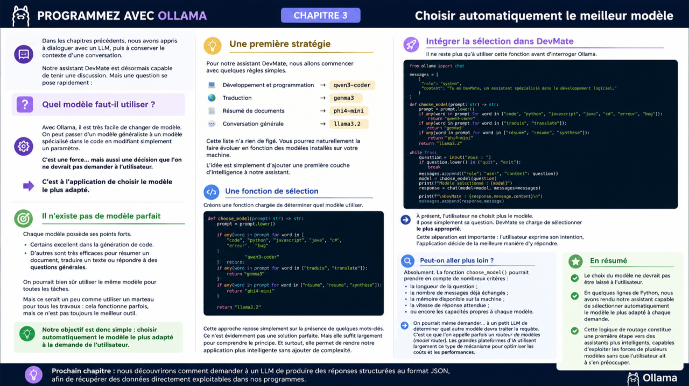
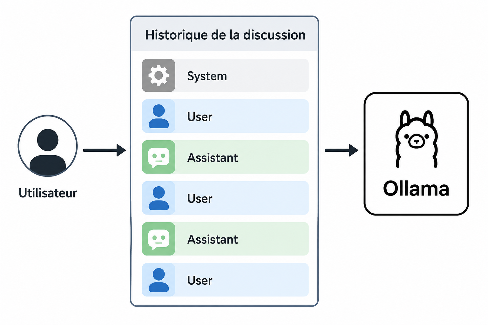

# Programmez avec Ollama : Chapitre 2 – Conserver le contexte d'une conversation



### Introduction

Dans le chapitre précédent, nous avons appris à dialoguer avec un modèle de langage grâce à Ollama.

Notre première application était simple : elle envoyait un prompt et affichait la réponse.

Mais une véritable conversation ne se limite pas à une succession de questions indépendantes. Lorsqu’un utilisateur échange avec un assistant, chaque réponse dépend des échanges précédents.

Comment un LLM peut-il répondre de manière cohérente s’il ne possède aucune mémoire ?

La réponse est simple : **c’est votre application qui lui fournit cette mémoire.**

Comprendre ce mécanisme est indispensable avant d’aller plus loin.

### Les LLM n’ont pas de mémoire

Contrairement à un humain, un modèle de langage ne se souvient de rien.

Entre deux appels, il oublie complètement ce qui s’est passé.

Prenons cet exemple.

**Utilisateur**

Je développe une application en Python.

**Assistant**

Très bien, quel framework utilisez-vous ?

Quelques secondes plus tard, l’utilisateur demande :

Comment ajouter une authentification ?

Si seule cette dernière question est envoyée au modèle, celui-ci ne sait plus que l’on parlait d’une application Python.

Pour lui, cette nouvelle requête est totalement indépendante.

Un LLM est donc **sans état** (​*stateless*​).

### Une conversation est un historique de messages

Pour donner l’impression d’une véritable discussion, il suffit de renvoyer les échanges précédents à chaque appel.

Autrement dit, une conversation n’est rien d’autre qu’une liste de messages qui s’enrichit au fil du temps.


À chaque requête, le modèle relit cet historique avant de produire sa réponse.

### Le format messages

L’API de chat d’Ollama utilise une liste de messages.

Chaque message possède un rôle :

* system : définit le comportement général du modèle ;
* user : représente les questions de l’utilisateur ;
* assistant : contient les réponses précédentes du modèle.

Voici un exemple.


Chaque nouvel échange est simplement ajouté à cette liste.

## Premier assistant conversationnel

Transformons maintenant le programme du chapitre précédent en un véritable assistant capable de conserver le contexte.


Le fonctionnement est très simple.

À chaque question :

1. le message de l’utilisateur est ajouté à l’historique ;
2. toute la conversation est envoyée à Ollama ;
3. la réponse est affichée ;
4. cette réponse est ajoutée à l’historique.

La conversation peut ainsi se poursuivre naturellement.

## Pourquoi ajoute-t-on la réponse du modèle ?

La ligne suivante est probablement la plus importante du programme.

```python
messages.append(response.message)
```

Sans elle, seule la moitié de la conversation serait conservée.

Le modèle retrouverait bien les questions de l’utilisateur, mais il oublierait ses propres réponses.

En ajoutant également les messages de l’assistant, on reconstitue fidèlement tout l’historique de la discussion.

## Les limites du contexte

L’historique d’une conversation ne peut pas grandir indéfiniment.

Chaque modèle possède une ​**fenêtre de contexte**​, exprimée en nombre de ​*tokens*​.

Lorsque cette limite est atteinte, les anciens messages doivent être supprimés, résumés ou archivés.

Nous découvrirons différentes stratégies dans les prochains chapitres.

## À retenir

Un LLM ne conserve aucune mémoire entre deux appels.

Pour maintenir une conversation cohérente, votre application doit conserver l’historique des échanges et le transmettre à chaque requête.

En pratique, un assistant conversationnel n’est rien d’autre qu’une liste de messages qui s’enrichit au fil de la discussion.

C’est ce principe qui permettra à **DevMate** de gagner progressivement de nouvelles capacités tout au long de ce livre : le streaming, les appels d’outils, la mémoire persistante, le RAG et, finalement, les agents.

